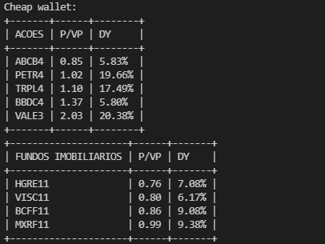

# Cheap Wallet

## Introdução
O **Cheap Wallet** é um script python que realiza a coleta de dados do site [statusinvest.com.br](https://statusinvest.com.br/) utilizando web scraping para a obtenção dos indicadores do P/VP (Preço/Valor Patrimonial) e DY (Dividend Yield) das suas Ações e Fiis listados na B3. Após isso, exibe uma tabela ordenada pelos ativos que estiverem com o menor P/VP. Isso e o DY ajudarão na análise de custo benefício para a escolha de suas ações no momento de compra. Atenção, este script tem fins didáticos e não deve ser utilizado sem a autorização dos responsáveis pelos dados, pois poderá ocasionar problemas de desempenho no site em que eles estão hospedados.

## Instalação
É necessário ter o python 3 instalado e recomendável a instalação do pyenv para o gerenciamento das versões do python (neste projeto foi utilizada a versão 3.8.2). Também é necessário a instalação do pipenv para a instalação das dependências de pacotes relacionadas. Após isso, dentro da pasta do projeto executar o comando `pipenv install` e em seguida o comando `pipenv shell` para ativação do ambiente virtual.

## Utilização
Para utilizar o script é necessário renomear o arquivo `src/.env-example` para `src/config/.env` e preencher as variáveis `STOCKS` e `FIIS` com os códigos correspondentes aos ativos que deseja acompanhar separados por vírgula. Em seguida, executar dentro do diretório `scr/` o comando: `python -m wallet`. Para evitar requests desnecessários é realizado cache das páginas utilizadas para a busca dos dados. Caso queira atualizar as informações é necessário excluí-los no diretório `src/cache`.

